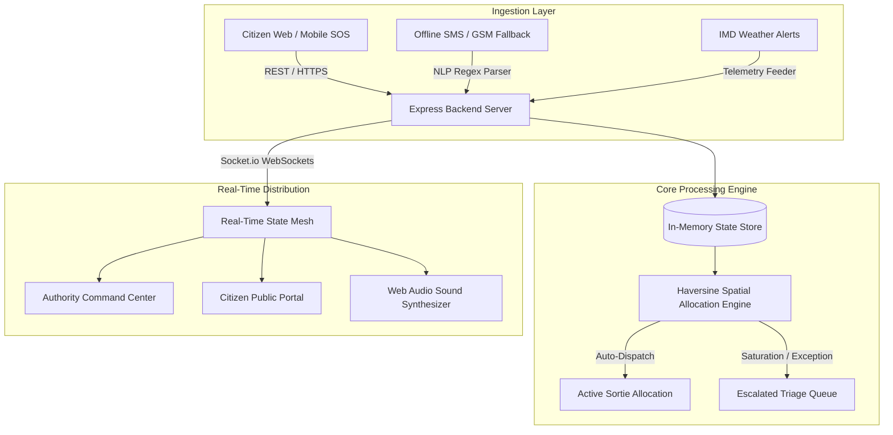
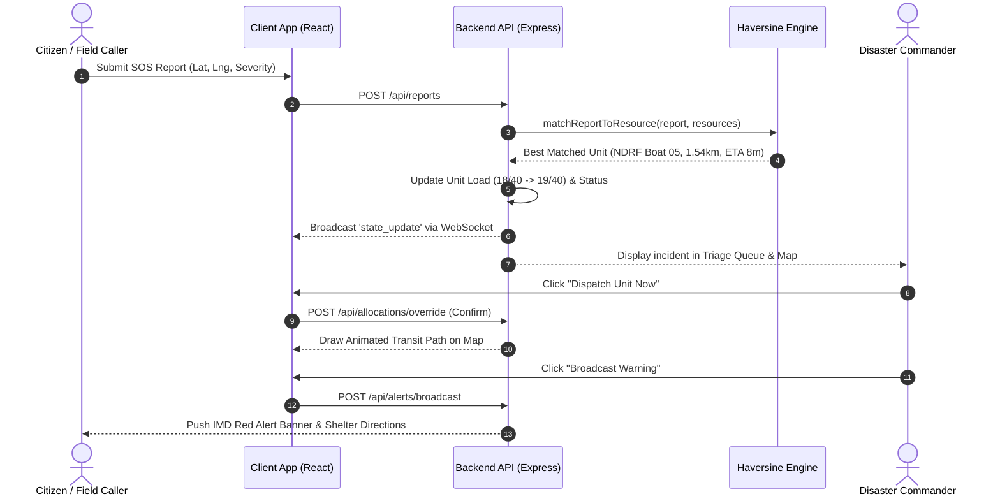

# SAHARAA (सहारा) — Comprehensive Technical Documentation
**Real-Time Disaster Early-Warning & Resource Coordination Platform**

---

## 1. Executive Summary & Architectural Overview

**SAHARAA** is a mission-critical, high-availability emergency response and spatial resource allocation platform designed for rapid deployment during urban flash floods, cyclones, and extreme weather emergencies.

The platform bridges the communication and coordination gap between three key disaster stakeholders:
1. **Citizens**: Affected individuals requiring immediate evacuation, medical triage, or relief shelter.
2. **Emergency Authorities / DDMA Dispatchers**: Command personnel monitoring live geospatial hazard maps, evaluating incident priority, and dispatching rescue assets.
3. **Field Rescue Units (NDRF, SDRF, Ambulances, Relief Shelters)**: Real-time operational teams mobilized based on proximity, asset capability, and bed/seat capacity headroom.



---

## 2. Technology Stack & Software Ecosystem

### Frontend Layer
| Technology / Library | Version | Role in Architecture |
| :--- | :--- | :--- |
| **React** | `18.3.1` | Core declarative UI component framework. |
| **Vite** | `5.4.21` | High-speed ESM build engine and HMR development server. |
| **Tailwind CSS** | `3.4.17` | Utility-first styling framework with CSS custom variables for dynamic theming. |
| **Leaflet & React-Leaflet** | `1.9.4` / `4.2.1` | High-performance canvas and tile-based geospatial mapping engine. |
| **Socket.io Client** | `4.8.1` | Bidirectional real-time event streaming and state synchronization. |
| **Lucide React** | `0.475.0` | Crisp vector iconography for operational command center elements. |
| **Web Audio API** | Native Browser | Zero-dependency synthesized tactical sound alerts (beeps, sirens, click tones). |

### Backend & Ingestion Layer
| Technology / Library | Version | Role in Architecture |
| :--- | :--- | :--- |
| **Node.js** | `v20.x+` | Asynchronous JavaScript runtime environment. |
| **Express.js** | `4.21.2` | RESTful API routing, payload validation, and static asset delivery. |
| **Socket.io Server** | `4.8.1` | Low-latency state broadcast engine with auto-reconnection handling. |
| **CORS** | `2.8.5` | Cross-Origin Resource Sharing middleware enabling flexible deployments. |

### Geospatial Tile Providers (100% Keyless & Watermark-Free)
| Layer Name | Provider / Source | URL Structure |
| :--- | :--- | :--- |
| **Street Operations** | OpenStreetMap Foundation | `https://tile.openstreetmap.org/{z}/{x}/{y}.png` |
| **Dark Tactical Base** | Esri Canvas World Dark Gray | `https://server.arcgisonline.com/ArcGIS/rest/services/Canvas/World_Dark_Gray_Base/MapServer/tile/{z}/{y}/{x}` |
| **Satellite Recon** | Esri World Imagery | `https://server.arcgisonline.com/ArcGIS/rest/services/World_Imagery/MapServer/tile/{z}/{y}/{x}` |

---

## 3. What Makes Saharaa Unique? (Core Innovations)

### 1. Zero-Friction 1-Click Haversine Spatial Matching
Unlike standard ticketing systems that require manual dispatcher assignment, Saharaa continuously computes straight-line distance ($d$) between incoming emergency tickets and all active rescue teams with remaining capacity. The commander can authorize deployment with a **single tap**, instantly plotting an animated transit route.

### 2. Dual-Mode Deployment Architecture
Saharaa is architected to deploy either:
- **As a unified single-container app** (Render, Railway, Fly.io, Heroku) where Express serves the pre-compiled React static bundle and API from a single port.
- **As a decoupled microservice** (Frontend on Vercel/Netlify, Backend on any cloud node) via dynamic `VITE_API_URL` environment binding.

### 3. Low-Bandwidth Offline SMS / GSM Telephony Gateway
During extreme cyclones or infrastructure damage where mobile data (4G/5G) is blacked out, citizens can send plain-text SMS messages:
$$\text{Format: }\texttt{FLOOD <PINCODE/AREA> <SEVERITY> <DESCRIPTION> <PHONE>}$$
The backend NLP parser extracts geolocation coordinates, classifies urgency, registers the report, and routes it into the live triage queue automatically.

### 4. Zero-Asset Synthesized Web Audio Tactical Sound Engine
Emergency alerts, dispatch tones, and clicks are synthesized purely via the browser's native **Web Audio API** oscillators (`AudioContext`). This ensures:
- **Zero latency**: Instant audio feedback without fetching MP3/WAV files over congested networks.
- **Zero broken assets**: No external audio CDN dependencies.

### 5. Seamless Native Design Token Theme Engine
A universal CSS custom variable system (`--bg-app`, `--bg-card`, `--text-primary`, `--border-subtle`) synchronizes backgrounds, cards, typography, inputs, Leaflet popup containers, and map tiles instantaneously when switching between ☀️ Light Mode and 🌙 Dark Tactical Mode.

---

## 4. Mathematical Models & Algorithmic Formulations

### A. Haversine Great-Circle Distance Equation
The spatial allocation engine computes the great-circle distance between an incident point $(\phi_1, \lambda_1)$ and a rescue unit $(\phi_2, \lambda_2)$ using Earth radius $R = 6371\text{ km}$:

$$\Delta \phi = (\phi_2 - \phi_1) \cdot \frac{\pi}{180}, \quad \Delta \lambda = (\lambda_2 - \lambda_1) \cdot \frac{\pi}{180}$$

$$a = \sin^2\left(\frac{\Delta \phi}{2}\right) + \cos\left(\phi_1 \cdot \frac{\pi}{180}\right) \cdot \cos\left(\phi_2 \cdot \frac{\pi}{180}\right) \cdot \sin^2\left(\frac{\Delta \lambda}{2}\right)$$

$$c = 2 \cdot \text{atan2}\left(\sqrt{a}, \sqrt{1 - a}\right)$$

$$d = R \cdot c \quad (\text{in kilometers})$$

### B. Urban Flood Transit ETA Estimation
Urban flood transit accounts for boat wading speed ($\approx 15\text{ km/h}$) and tactical preparation delay ($3\text{ mins}$):

$$\text{ETA (minutes)} = \max\left(3, \left\lfloor d \times 4 + 3 \right\rceil\right)$$

### C. Rule-Based Priority Score Formulation ($0 - 100$)
Every incident is scored dynamically based on severity, hazard type, and reporting delay:

$$\text{Score} = \min\left(100, S_{\text{severity}} + C_{\text{category}} + T_{\text{decay}}\right)$$

Where:
- $S_{\text{severity}} \in \{ \text{Critical: } 50, \text{High: } 35, \text{Medium: } 20, \text{Low: } 10 \}$
- $C_{\text{category}} \in \{ \text{Trapped: } 25, \text{Medical: } 25, \text{Landslide: } 25, \text{Flood: } 20, \text{Shelterless: } 15, \text{Food/Water: } 10 \}$
- $T_{\text{decay}} = \min\left(25, \lfloor \text{Minutes Since Report} \times 1.5 \rfloor\right)$

### D. Shelter Headroom & Capacity Balance
$$\text{Free Beds} = \max\left(0, \sum \text{Capacity}_i - \sum \text{CurrentLoad}_i\right)$$
$$\text{Occupancy Ratio (\%)} = \left\lfloor \frac{\sum \text{CurrentLoad}_i}{\sum \text{Capacity}_i} \times 100 \right\rceil$$

---

## 5. End-to-End Operational Workflows



---

## 6. REST API & WebSocket Specifications

### REST Endpoints
| Method | Endpoint | Description | Key Parameters |
| :--- | :--- | :--- | :--- |
| `GET` | `/api/health` | Healthcheck endpoint for cloud platforms. | None |
| `GET` | `/api/state` | Returns full system state (reports, resources, alerts). | None |
| `POST` | `/api/reports` | Creates citizen emergency SOS ticket. | `category`, `severity`, `lat`, `lng`, `description`, `phone` |
| `POST` | `/api/sms/incoming` | Ingests offline SMS emergency message. | `text` or `Body`, `From` or `phone` |
| `POST` | `/api/alerts/broadcast` | Issues regional early-warning alert. | `title`, `message`, `level`, `area` |
| `POST` | `/api/allocations/override` | Manual commander dispatch or re-allocation. | `report_id`, `resource_id`, `notes` |
| `POST` | `/api/reports/:id/resolve` | Resolves incident and de-allocates asset. | `id` (path param) |
| `POST` | `/api/resources` | Registers a new field team or shelter. | `name`, `type`, `lat`, `lng`, `capacity` |
| `POST` | `/api/demo/scenario-step` | Executes progressive crisis scenario step (1-5). | `stepNumber` |
| `POST` | `/api/demo/reset` | Resets store to initial baseline state. | None |

### WebSocket Events (`Socket.io`)
- **`initial_state`**: Emitted immediately upon client connection with complete database snapshot.
- **`state_update`**: Emitted whenever any report is logged, dispatched, resolved, or alerted.

---

## 7. Build, Run & Deployment Guide

### Local Development
```bash
# 1. Install all dependencies across monorepo
npm install
npm install --prefix client
npm install --prefix server

# 2. Start both backend (port 4000) and frontend (port 5173)
npm run dev
```

### Production Build & Standalone Server
```bash
# 1. Build optimized React client
npm run build --prefix client

# 2. Launch production Node server (serves API + static frontend)
node server/index.js
```

### Environment Variables
| Variable | Default | Purpose |
| :--- | :--- | :--- |
| `PORT` | `4000` | Port for the Express backend server. |
| `VITE_API_URL` | `""` (same origin) | Backend URL override if deploying client separately (e.g. on Vercel). |
